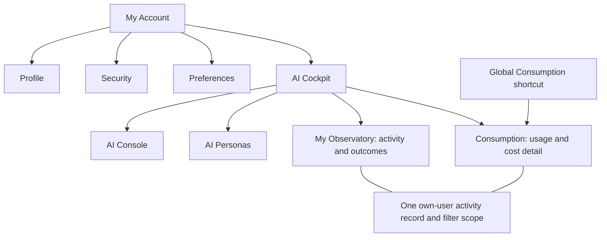

# Journey 5: one account area, four logical blocks

Journey 5 should answer four questions: **Who am I and how do I secure my account? How should Madhav look and respond? Which AI setup should it use? What did it do and what did that consume?**

The current design contains useful capabilities, but mixes these questions and repeats their controls. Consolidate their ownership rather than delete capabilities simply because they appeared in an older design. Retain the owner's AI Cockpit grouping under My Account.

This is a reconciliation proposal. The Claude prototype, application, account settings and deployed service have not been changed by this review.

## 1. Proposed structure

| Logical block | Contents | One clear home |
|---|---|---|
| **Identity and security** | Username, display name, email; password/recovery; supported sign-in controls | My Account → Profile / Security |
| **Preferences** | Title toggle, reading size, reduced motion, panel pins, grounding placement; preferred depth and persona | My Account → Preferences |
| **AI setup and personas** | API connections, local CLI access, tested models, saved four-role configurations, one exact AI default; persona instructions and response style | My Account → AI Cockpit → AI Console / AI Personas |
| **Activity and consumption** | Own calls and outcomes, activity by connection/model, usage completeness, costs, conversation/question/call detail | My Account → AI Cockpit → My Observatory / Consumption, sharing one activity record and filters |

**My Observatory and Consumption remain distinct views.** Observatory answers “What happened, through which connection/model, and did it work?” Consumption answers “What usage and cost can be attributed to that work?” They should not calculate independent totals or maintain parallel reports. The four Cockpit subareas requested by the owner remain recognizable.

My Account and AI Cockpit are containers. Their landing pages should be small indexes with meaningful summaries, not two additional dashboards repeating all child screens. Keep Profile as the place to edit identity; do not merge its form into multiple landings.

## 2. What happens to the seven existing review pages

| Review page | Disposition | Result |
|---|---|---|
| **18 My Account** | **Simplify** | One compact identity summary and entries to Profile, Security, Preferences and AI Cockpit. Avoid repeating an entire tab bar as large descriptive cards. |
| **19 Profile** | **Retain and correct** | Username prominent alongside name/email. Remove obsolete “administrator action” wording unless the actual policy imposes it. Current source has an active-user username setup/edit endpoint. |
| **20 Security** | **Retain; qualify capabilities** | Password and recovery belong here. Browser sign-in sessions and external MCP credentials are different things. List/revoke only controls supported by the corresponding backend. |
| **21 Preferences** | **Retain and consolidate** | Appearance/panel preferences plus Deep (Recommended) and Classical Parāśari. Mirrored in-context controls operate on the same saved setting. Persona management stays in Cockpit. |
| **22 AI Personas** | **Retain within Cockpit** | Create/edit/delete named instructions and response style. One default persona, shared with Preferences. Existing stack associations require explicit compatibility handling, not silent deletion. |
| **23 AI Cockpit · AI Console** | **Separate container from task** | Cockpit is the group; Console is its configuration screen. Keep provider connections, local CLIs, tested models, custom API/CLI configurations and all four roles. Remove the separate standalone AI Connections destination. |
| **24 Consumption** | **Retain within Cockpit** | One own-user usage destination with conversation → question → call detail. Global/account links resolve to it. Share activity data and scope with My Observatory. |

Preserve review serials 18–24. Review numbering is an audit aid, not a requirement for seven equally prominent navigation items. Keep existing accepted English/Sanskrit pairs; AI Cockpit and My Observatory's proposed Sanskrit names remain provisional.

## 3. Duplication and redundancy found

### A. Repeated containers and shortcuts

**Account landing → Cockpit landing → child page**, each repeating cards, tabs or explanatory text, creates extra steps. Keep one compact account index and a light Cockpit shell with direct child navigation. Provide a clear return to My Account from every Cockpit subarea.

The profile sidebar repeats Personas, Consumption, Preferences, sign-out and an own-chart card. Retain a shortcut only when it helps a specific task; general navigation belongs in the shared shell. A single Sign out action in the account menu is sufficient, apart from separate security-session actions.

The own-chart identity/birth card is repeated on Account and Profile. Account identity is distinct from chart identity. Prefer one “Birth Charts” shortcut; do not make account management depend on a fixed native chart or an assumed one-to-one user/chart relationship.

The prototype still has a global Niyantraṇa/Cockpit destination as well as account AI Cockpit. The latest owner direction places personal AI under My Account. Recommend a rail shortcut, if retained, that goes to that same group. Historical operator Cockpit destinations remain restricted and can be reached through Administration. This is a navigation recommendation, not an instruction to delete operational services.

### B. Activity displayed in three places

AI Console includes a full “My activity · by connection and model” tree. My Observatory repeats that tree, and Consumption presents another set of totals and detail. Console should show connection readiness and, at most, a small “View activity” link preserving that connection filter. Observatory owns activity; Consumption owns its usage/cost drilldown.

The current rendered My Observatory has **5,443 calls** in its seven-day headline but **6,483 calls** in its default connection/model breakdown. The table has a breakdown-only filter disclaimer, but the initial same-user/seven-day mismatch still has no reconciliation. These are fictional prototype values, not the user's live usage.

Consumption uses a separate illustrative 1–4 October ledger with **38 calls**, while a fixed **711 CLI calls** is shown independently. A different period can legitimately produce different totals; the defect is that the values do not demonstrably derive from one scope. In the exported code, chart filtering changes conversation rows/call count while receipt, estimate, completeness and CLI summaries remain fixed.

**Proposed rule:** every summary, graph, table and drilldown receives the same owner, dates/timezone and relevant filters. Broader activity can include builds or jobs beyond conversations; expose that difference with purpose categories and an unattributed bucket. Do not force different populations to match by inventing identity or cost.

Preserve **API → provider/connection → model** and **CLI → CLI connection → model**, including both aggregator and underlying model identity. Preserve activity bars and labelled health lines; they communicate different measures. Missing telemetry is unavailable; measured zero is zero. Estimated cost, provider receipts and subscription/unmetered CLI usage remain distinguishable.

### C. Defaults with competing ownership

There are three separate concepts that should not all be called a model/default stack:

| Setting | Owner | Proposed behavior |
|---|---|---|
| Reading depth | Preferences | Deep (Recommended) for a new question, unless the user explicitly chooses another depth. |
| Default persona | AI Personas, mirrored in Preferences | Classical Parāśari initially; one saved default per user. Both controls edit the same value. |
| Default AI configuration | AI Console | One exact provider/CLI or saved four-role configuration used when the consultation's AI choice is Default. |

In the prototype, Preferences stores a persona ID separately from the Personas list's `isDefault` state. Choosing a default in one does not establish synchronization with the other. New/edited personas also live in separate component state, while Preferences reads the fixed fixture list. This needs one shared persona store.

Similarly, “Make default” changes a configuration row, while the Console headline remains hard-coded to “Default stack.” The four-role display is another independent fixture. The selected configuration should drive both the header and its role assignments.

Personas currently contain “Fast / Standard / Deep” stack labels; the production persona schema also retains `default_stack`, and an existing chat picker consumes it. These are **not proven dead fields**. Recommend making persona instructions/style primary, with “Use account AI default” as the normal behavior. Preserve existing associations until their consumers are mapped and an explicit override/compatibility rule is implemented. Do not delete stored configurations or silently change execution behavior.

### D. Configuration clutter that can be folded, not discarded

Keep API and local CLI access visibly distinct: API keys and CLI grants/subscriptions have different mechanics. One Console may present both, but a CLI must not have an API “Replace key” action. The latest prototype already removed that misleading duplicate card.

Put catalog listings inside the connection's model picker or an expandable details section. Keep **listed**, **tested for generation**, **available/granted**, and **observed in use** distinct. A long standalone catalogue is unnecessary on the main configuration screen; its verification distinction is essential.

Keep Synthesizer, Planner, Deep Planner and Worker inside the selected configuration/editor. They are meaningful existing execution roles. They should not become four independent global defaults competing with the selected saved configuration. Retain custom API/CLI configuration groups to respect the owner's “reuse current Console” instruction.

### E. Account/security material inherited without adequate grounding

The Profile prototype says email change happens through Security, but Security has no email-change flow. Remove that promise or implement a separately specified verified-email workflow. The optional phone field and “member since” are secondary; keep them only where an established account purpose warrants them. They do not need repeated summary cards.

The Security fixture lists “Claude Desktop via MCP key” as a session beside this browser and an iPhone. A key/token is not a browser login session. Its revocation needs the appropriate access-management surface and permissions. Keep existing reviewed Client Keys administration intact; provide a personal access link only if a user-scoped capability is established.

“Password changed. Other sessions were signed out” and “takes effect within a minute” are simulated claims. Preserve password/recovery functionality as required account work, but tie real product wording to actual revocation behavior. No new device inventory, MFA or connection-management feature is inferred from the mockup.

## 4. Feedback retained and older directions superseded

| Feedback | Reconciled treatment |
|---|---|
| Username is important on My Account/Profile; later “Account name” becomes “Username” | Display Username consistently. The remaining label “Username · account name” is stale active copy. Keep post-approval setup, not request-stage username selection. |
| Deep (Recommended); default Classical Parāśari | Retain both, with separate depth/persona/AI-configuration semantics. Respect explicit saved choices. |
| Replace standalone AI Connections with account AI Cockpit | Retain Console, My Observatory, Consumption and Personas as subareas. Connections remain inside Console. |
| Follow the existing Console and Observatory capabilities | Retain integrations, four roles, API/CLI configurations and model-access distinctions; simplify presentation without reducing these to generic connection cards. |
| Activity breakdown by API/CLI connection and underlying model | One reusable own-scope hierarchy; contextual filtering from Console and Consumption. |
| Health graphs need labels, legends, units and logical buckets; activity bars also retained | Keep both graph purposes. Tool-family taxonomy is still a proposal. Global health belongs to Administration; personal health needs real own-scope evidence. |
| One Consumption destination accessible from multiple places | One canonical view with shortcuts/aliases, not copied reports. |
| One shared visual foundation and compact title toggle | Keep selected Marsys/Madhav treatment, dark ground/subdued gold, shared typography, rounded panels and header-only language switch. In Preferences, mirror the same preference rather than introduce a second language setting. |
| Remember panel pins and grounding placement | One setting shared with in-context controls. Default-closed Consultation respects an explicit pin. |
| Advanced direct users, not practitioner/client-management audience | Keep personal account and authorized-chart scope; exclude unrelated client-management dashboards from Journey 5. |

The latest page feedback supersedes older “standalone AI Connections,” account-name terminology and ambiguity about the personal AI grouping. Older source tables and archives should retain their provenance; current review copy should state the latest decision once.

The Hub labels 20 Security “Not yet reviewed,” 22 Personas “Reviewed — retained,” and the other Journey 5 pages “Revised — awaiting re-review.” Do not interpret a broad portal walkthrough as acceptance of every security control or of this new consolidation.

## 5. Current code versus dated prototype claims

Source checked against protected `origin/main` **f50a00091db22ac794c33d188941591e91aa0792**, matched to the remote main reference on 6 October. Relevant inspected files match the owned clean checkout. This is source inspection, not fresh live acceptance of these workflows.

| Area | Evidence and implication |
|---|---|
| AI Console | Active-account layout and feature gate; existing API/local CLI sections, configurations and exact default. Reuse this capability. |
| Personal activity/consumption | Observatory layout supplies own-user scope; non-admin requests use `/api/usage`, whose owner is derived from authenticated identity. `/usage` redirects to `/observatory/consumption`. Older “all Observatory is super-admin-only” prototype copy is outdated. |
| System diagnostics | Admin Observatory routes retain feature and super-admin guards. Personal activity already existing does not establish personal access to every MCP health/trace/admin diagnostic. |
| Username | `/setup-account` and `/api/account/username` exist for active users, including availability/save handling. Prototype admin-only username wording does not describe this current source. Real saving was not exercised here. |
| Personas | User-scoped CRUD and default fields exist. Older stack linkage has a consumer and must be reconciled deliberately. |
| General Profile/Security/Preferences | The inspected app route inventory does not establish the complete proposed account-area workflows. Mockup controls are requirements/demonstrations, not verified functionality. |

## 6. Recommended revision boundary

Revise the **same current prototype**, preserving review numbers and archives. First simplify the My Account/Cockpit containers and settle each setting's owner. Then use one coherent fictional activity ledger and filter scope across Observatory/Consumption, with honest detail coverage. Remove contradictory copy, duplicated full activity tables and unrelated operational dashboards from the personal path. Preserve the four Console roles, both access methods, personas and cost evidence.

The resulting review should demonstrate: choosing a persona default in either place gives the same result; a new consultation starts at the agreed depth; selecting an AI configuration updates its exact-default summary; connection-filtered activity uses the same scope as Consumption; and direct-user pages never expose another user's conversations, usage or system-wide controls. Implementation and release remain separate later work.

## Evidence used

- Current Claude Design project: [Madhav Review Hub](https://claude.ai/design/p/acd0adbd-f395-43db-ab98-6df72a224e77?file=Review%20Hub.dc.html), live pages 18–24 and Cockpit subareas inspected in this conversation.
- Latest “Foundation v1.2 repair pass” feedback: messages 35, 38, 40, 42 and 49; locally captured in `foundation-feedback-messages.json`. Capture contains the relevant messages and surrounding history, not a claim that every historical conversation was exhaustively exported.
- Original owner page-review wording checked read-only in “Plan Marsys GIS frontend redesign,” turn `01a1080d-6e84-7040-be61-274a454b31f5`, including the following API/CLI model-breakdown clarification; later username correction in turn `01a10bc5-5269-7342-9b7d-6d2b55f7608f`.
- [Consolidated feedback register](/Users/Dev/Documents/Codex/2026-10-04/claude-design-current/FEEDBACK_REGISTER_v1.0.md): F02–F04, F16–F22, F28, F30–F46, F65–F69, F80–F87 and F88–F90. Dated implementation-status claims were checked against current source rather than treated as current fact.
- Saved current export, revision 02: `PgAccount.dc.html`, `PgOps.dc.html`, `portal-data.js`; matched against representative current rendered screens. Historical export remains unchanged.
- Current source: AI Console layout/component, Observatory layout/scope/subnav, usage page/API, admin guard, username route/setup and persona repository/types/chat picker.

Changelog: v1.0 consolidates existing feedback, current design duplication and current source evidence into four logical blocks. All structural changes remain proposed for review.
