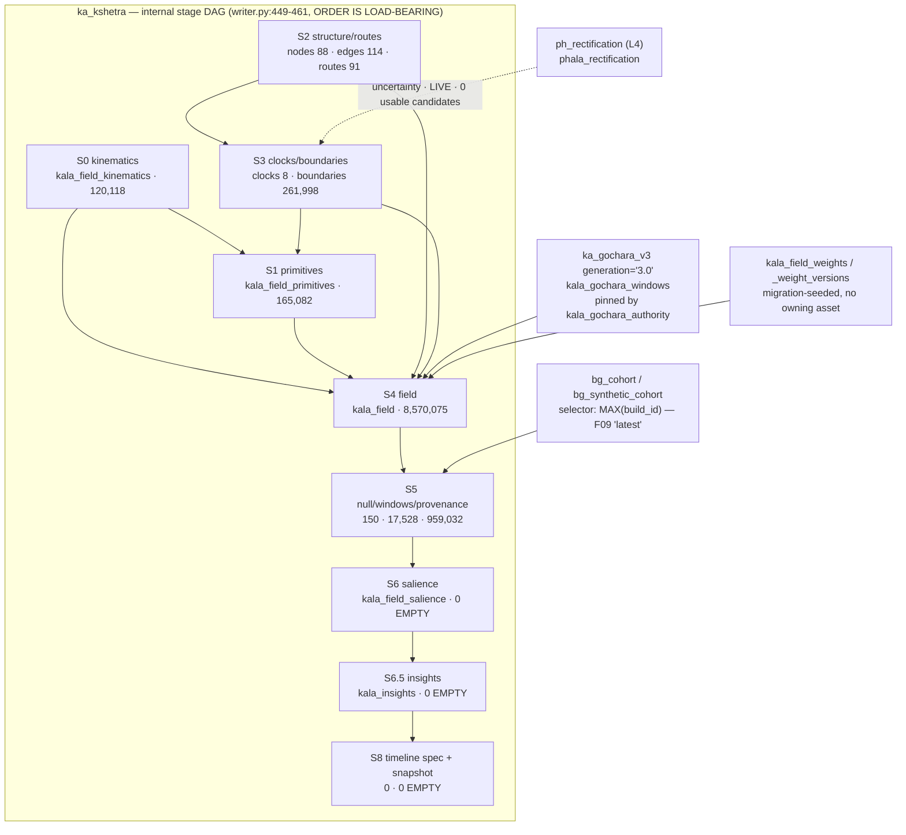

# KĀLA — INTERNAL INPUT / OUTPUT / USE MATRIX

## §1. What this is, and the two-map requirement

`MADHAV_DATA_PLANE_L3_KALA_STRATEGY_v1_0.md` §4 opens:

> Maintain two related maps: the computational build DAG and the semantic relationship/use graph.
> Only genuine computation prerequisites constrain build order. Shared definitions, serving
> hydration, protected evaluation and separately admitted future artifacts retain their distinct
> edge types.

This artifact is those two maps for all 22 active `ka_*` identities, the protected retired
`ka_gochara_sweep`, and Kshetra's internal S0–S8 stages as sub-nodes. Every edge carries the five
fields §4 mandates — **role** (F12 operator), **source**, **generation selector**, **required
coverage** — plus an **edge kind** that decides whether it constrains build order.

**It is a map. It authorizes nothing.** It does not certify the deployed scheduler, does not
propose a fix for anything it finds, and does not re-open any settled acceptance. Where an edge
could not be sourced it is recorded `source: unresolved_dynamic` and listed as a verification
task, per §6.3's explicit allowance.

**Header counts** (from `fixtures/kala_io_use_edges_v1_0.json`):

| | count |
|---|---:|
| **Total edges** | **178** |
| `computational_prerequisite` (constrains build order) | 99 |
| `serving_hydration` | 22 |
| `fk_preservation` | 20 |
| `shared_definition` | 19 |
| `semantic_use` (downstream / orphan) | 15 |
| `protected_evaluation` | 3 |

| F12 operator role | count |
|---|---:|
| `computation` | 91 |
| `exclusion` | 21 |
| `interpretation` | 16 |
| `relevance_navigation` | 13 |
| `applicability` | 12 |
| `counterevidence` | 11 |
| `evaluation` | 10 |
| `uncertainty` | 4 |

| source | count |
|---|---:|
| `writer_sql` | 102 |
| `serving_read` | 22 |
| `unresolved_dynamic` | 21 |
| `fk_constraint` | 19 |
| `helper_or_service_call` | 13 |
| `view_or_function` | 1 |

`registry_depends_on` appears as the `declared_in_registry` flag on every edge rather than as a
`source` value, because a registry declaration is a *claim about* an edge, never evidence that the
edge exists. Twenty-one edges have no source but the claim; they are the `unresolved_dynamic` rows.

### §1.1 The one finding that governs the rest

**There is exactly one real generation selector in the whole layer.** Every other read in L3 —
writer, service and serving alike — selects a mutable `public` table on `chart_id` (sometimes plus
an `ayanamsha_id` convention pin) and takes whatever is there. F09 says "`latest` is never a
compatibility rule"; almost every L3 read is *weaker* than `latest`, because it does not even ask
which generation it got.

The one exception is `kala_gochara_authority`:

```sql
-- services/ka_kshetra/stage4_field.py:1384-1389, and identically at
-- platform-mcp/src/tools/retrieval/register_gochara_windows.ts:640-643
AND generation = COALESCE(
      (SELECT authoritative_generation FROM kala_gochara_authority
        WHERE chart_id = kala_gochara_windows.chart_id), 'v1')
```

Measured live:

```sql
SELECT substr(chart_id::text,1,8), authoritative_generation, flipped_at, flipped_by
FROM kala_gochara_authority ORDER BY 1;
-- 1c826d5a | 3.0 | 2026-08-11 09:10:42+00 | parishkara-mr24-battery
-- 482012f1 | 3.0 | 2026-08-11 09:44:07+00 | parishkara-mr08-operator
```

The second exception-shaped thing is not an exception: `services/ka_kshetra/writer.py:2304`
`SELECT MAX(build_id::text) AS b FROM bg_synthetic_cohort` — a literal `latest` selector, the
precise construct F09 names.

Two narrower pins exist and are stated precisely rather than counted as generation selectors:
`kala_field_weights.version_id → kala_field_weight_versions` (a FK-enforced version pin whose
**selection rule was NOT traced this pass** — E103), and `build_substep_progress.build_fingerprint`,
which pins *resume compatibility within one asset's own run* (`services/ka_kshetra/writer.py:2436-2463`;
`ka_sangam.py:491`) and says nothing about which upstream generation was read. Neither selects an
upstream producer's generation, which is what F09 governs. `ayanamsha_id` pins seen throughout
(e.g. `ka_avadhi.py:71`) are convention pins, not generation pins.

Verified negatively: `build_id` never appears as a read predicate anywhere in L3 source. Every
occurrence in `pipeline/orchestrator/writers/ka_*.py`, `services/ka_*/*.py`, `services/gochara_v3/*.py`
and `services/taranga_service.py` is a WRITE into a build-state table, except the single
`MAX(build_id)` above.

---

## §2. The computational build DAG

Only `computational_prerequisite` edges appear here. 99 edges. Shared definitions, FK cascades,
serving reads and protected evaluation are held out to §3 and §6.

### §2.1 Diagram (observed reads, not registry declarations)

```mermaid
graph TD
  subgraph UP["upstream — L0 / L1 / L2"]
    EPH["bg_ephemeris / ephemeris_daily"]
    FACTS["chart_facts — 8 ga_* producers"]
    DASH["ga_dashas / chart_dashas"]
    TAJ["ga_tajaka / l1_tajik_varsha_year_lords"]
    YOGA["ga_yoga / ga_yoga_firings"]
    MSR["bodha_msr_signals — 7 bo_* producers"]
    PRAT["bo_pratijna"]
    CGMN["bo_bimba / bodha_cgm_nodes"]
    CGME["bo_karanajala / bodha_cgm_edges"]
    CDLM["bo_sangati / bodha_cdlm_cells"]
  end

  subgraph SVC["service identities — no materialized rows"]
    SANC["ka_graha_sancara"]
    DKALA["ka_dasha_kala"]
    MUHU["ka_muhurta_seva"]
    TUL["ka_tulana — no production caller"]
  end

  subgraph OVL["overlays and independent preparation"]
    RES["ka_gochara_resonance"]
    MOOR["ka_moorti_nirnaya"]
    KOTA["ka_kota_chakra"]
    VED["ka_vedha_gochara"]
    TITHI["ka_tithi_pravesha"]
    SUD["ka_sudarshana_varsha"]
  end

  EPH --> SANC
  EPH --> MOOR
  EPH --> KOTA
  EPH --> VED
  DASH --> DKALA
  DASH --> RES
  DASH --> AVA
  DASH --> SAN
  DASH --> TAR
  DASH --> JIV
  DASH --> KAL
  DASH --> VIG
  FACTS --> MOOR
  FACTS --> KOTA
  FACTS --> VED
  FACTS --> TITHI
  FACTS --> SUD
  FACTS --> RES
  FACTS --> YOJ
  FACTS --> AVA
  FACTS --> SAN
  FACTS --> VIG
  TAJ --> TITHI
  TAJ --> SAN
  YOGA --> RES
  YOGA --> YOJ
  MSR --> YOJ
  MSR --> SAN
  MSR --> BHAV
  PRAT --> YOJ
  PRAT --> AVA["ka_avadhi"]
  PRAT --> TAR["ka_taranga"]
  CGMN --> YOJ["ka_yojaka"]
  CDLM --> YOJ

  RES --> GOC["ka_gochara — writes kala_gochara_windows_v2 gen 2.0"]
  RES --> V3["ka_gochara_v3_century_materialize"]
  VED --> V3
  MOOR --> V3

  YOJ --> SAN["ka_sangam"]
  VED --> SAN
  DKALA -. "service call" .-> SAN
  MUHU -. "service call" .-> SAN
  GSVC["services.ka_gochara GocharaTransitService — live ephemeris, NOT the ka_gochara asset"] -. "service call" .-> SAN
  TRIG["services.kala_trigger — no registry row"] -. "helper" .-> SAN

  YOJ --> KAL["ka_kalasutra"]
  SAN --> KAL
  SAN --> VIG["ka_vighnakara"]
  YOJ --> VIG
  MUHU -. "service call" .-> VIG
  SAN --> TAR
  SAN --> DAR["ka_kala_darshana"]
  VIG --> DAR
  SAN --> JIV["ka_jivana_parva"]
  DAR --> JIV
  YOJ --> JIV
  SAN --> BHAV["ka_bhavishya_lekha"]
  DAR --> BHAV
```



Edges the **registry declares but the code does not show** are deliberately absent from this
diagram: `ka_avadhi → ka_taranga`, `ka_kalasutra → ka_kala_darshana`, `ka_vighnakara →
ka_bhavishya_lekha`, `ka_kota_chakra / ka_tithi_pravesha → ka_gochara_v3`, and all three
`ka_tulana` inbound edges. §4.1 adjudicates each.



Kshetra's stage prerequisites **confirm STRATEGY §6.2 exactly**. The code states the same graph in
prose and gives its reasons:

```
services/ka_kshetra/writer.py:449-461
  # ORDER IS LOAD-BEARING (SAMPURTI G1):
  #   stage0 → stage2 → stage3 → stage1
  #   • stage2 reads bodha_cgm_nodes/edges/pratijna (no stage0 dependency)
  #     but must run before stage3 because stage3 reads kala_field_routes
  #     (written by stage2) in clock_activation/_route_gain_and_sign_for_lord.
  #   • stage3 reads chart_dashas AND kala_field_routes (stage2 output),
  #     writes kala_field_clocks + kala_field_boundaries.
  #   • stage1 reads BOTH kala_field_kinematics (stage0 output) AND
  #     kala_field_boundaries (stage3 output) for the sandhi_band primitive;
  #     it must therefore run after BOTH stage0 and stage3.
  #   • stage4+ reads all of the above.
```

### §2.2 Edge table — computational prerequisites

Full field set (including every `required_coverage` note) is in
`fixtures/kala_io_use_edges_v1_0.json`. Abbreviated here: **GS** = generation selector,
`chart_id only` means the F09-violating default described in §1.1.

| id | from | to | F12 role | source | evidence | GS | coverage |
|---|---|---|---|---|---|---|---|
| E001 | ga_dashas/`chart_dashas` | ka_avadhi | computation | writer_sql | `ka_avadhi.py:72-95` | ayanamsha pin `lahiri_chitrapaksha` (`:71`) | MET (1,169 rows) |
| E002 | bo_pratijna | ka_avadhi | applicability | writer_sql | `ka_avadhi.py:99-110` | ayanamsha pin | MET (135 pratijna rows) |
| E004 | ga_positions/`chart_facts` | ka_avadhi | relevance_navigation | writer_sql | `ka_avadhi.py:132-141` | ayanamsha + category pin, total ORDER BY + `LIMIT 10` | bounded by an explicit cap |
| E005 | bo_laksana +6/`bodha_msr_signals` | ka_yojaka | computation | writer_sql | `ka_yojaka.py:85` | chart_id only | **MET exactly** — 50,678 predicates ↔ 50,678 MSR signals |
| E006 | bo_pratijna | ka_yojaka | applicability | writer_sql | `ka_yojaka.py:155,176` | chart_id only | not measured |
| E008 | bo_bimba/`bodha_cgm_nodes` | ka_yojaka | computation | writer_sql | `ka_yojaka.py:538` | chart_id only | not measured |
| E009 | bo_sangati/`bodha_cdlm_cells` | ka_yojaka | computation | writer_sql | `ka_yojaka.py:561,573` | chart_id only | not measured |
| E010 | ga_yoga/`ga_yoga_firings` | ka_yojaka | computation | writer_sql | `ka_yojaka.py:609` | chart_id only | **undeclared** |
| E011 | `chart_facts` | ka_yojaka | computation | writer_sql | `ka_yojaka.py:472,505,650` | chart_id only | **undeclared** |
| E014–E018 | ga_positions/`chart_facts` | moorti, kota, vedha, tithi, sudarshana | computation | writer_sql | each service `writer.py` (`:70/:78/:93/:74/:48`) | chart_id only | MET (all five have rows) |
| E019 | bg_ephemeris | ka_moorti_nirnaya | computation | writer_sql | `ka_moorti_nirnaya/writer.py:77` | n/a global | **−60/+400 d only** (§6.1 A06) |
| E028 | ga_tajaka | ka_tithi_pravesha | computation | writer_sql | `ka_tithi_pravesha/logic.py:129` | chart_id only | **undeclared** |
| E029 | bg_transit_rules | ka_gochara_resonance | computation | writer_sql | `ka_gochara_resonance/writer.py:277,375` | n/a global | not measured |
| E030–E033 | bg_ghatana, chart_facts, ga_yoga_firings, chart_dashas | ka_gochara_resonance | mixed | writer_sql | `ka_gochara_resonance/writer.py:369,382,389,396,412` | chart_id only | **all four undeclared** |
| E034 | bg_gochara_arcs | ka_gochara | computation | writer_sql | `ka_gochara.py:412` | n/a global (33,933 rows) | not measured |
| E035 | ka_gochara_resonance | ka_gochara | relevance_navigation | writer_sql | `ka_gochara.py:193` | chart_id only | MET (765 → 87) |
| E036 | ka_gochara_resonance | ka_gochara_v3 | relevance_navigation | writer_sql | `ka_gochara_v3…py:373,1239,1299` | chart_id only | MET |
| E037 | ka_vedha_gochara | ka_gochara_v3 | **counterevidence** | helper_or_service_call | `gochara_v3/context.py:82,449` → `quality_gates` | chart_id only | producer is day-grade rolling (177 rows) |
| E038 | ka_moorti_nirnaya | ka_gochara_v3 | applicability | helper_or_service_call | `gochara_v3/context.py:510` | chart_id only | **NOT MET by construction** — 71 rows over ±1 yr feeding a *century* materializer |
| E042 | ka_yojaka | ka_sangam | computation | writer_sql | `ka_sangam.py:285-286` | chart_id only | **NOT MET** — ≤260 of ~50,104 predicates reach convergence (`query_temporal_activation.ts:290-291`) |
| E044 | ka_vedha_gochara | ka_sangam | counterevidence | writer_sql | `ka_sangam.py:1037-1060`; `engine.py:73` | chart_id only | **undeclared**; same evidence also attenuates at E037 |
| E048 | ka_dasha_kala (service) | ka_sangam | computation | helper_or_service_call | `ka_sangam.py:35` | live call | not measured |
| E049 | ka_muhurta_seva (service) | ka_sangam | applicability | helper_or_service_call | `ka_sangam.py:37` | live call | not measured |
| **E050** | **services.ka_gochara `GocharaTransitService`** | ka_sangam | computation | helper_or_service_call | `ka_sangam.py:36`; `services/ka_gochara/service.py:5-20` | live ephemeris | **adjudicates §6.3 #3 — see §4.3** |
| E051 | services.kala_trigger (no registry row) | ka_sangam | computation | helper_or_service_call | `ka_sangam.py:38`; `kala_trigger/trigger.py:256` | chart_id only | **undeclared, unowned** |
| E052 | ka_yojaka | ka_kalasutra | computation | writer_sql | `ka_kalasutra.py:45` | chart_id only | **capped at 8 periods/predicate, no truncation flag** (`date_resolver.py:417,500`) |
| E053 | ka_sangam | ka_kalasutra | computation | writer_sql | `ka_kalasutra.py:73-77` | chart_id only | **one best row per signal kept** (`:82-90`) — see §7.1 |
| E054 | ga_dashas via `services/ka_temporal` | ka_kalasutra | computation | helper_or_service_call | `ka_kalasutra.py:16`; `date_resolver.py:350` | per-ayanamsha pin **+ implicit `date.today()`** (`date_resolver.py:473`) | **undeclared**; output is a function of the build date |
| E056 | ka_sangam | ka_vighnakara | computation | writer_sql | `ka_vighnakara.py:179` | chart_id only | top-500 cap (§6.1 A17) |
| E057 | ka_yojaka | ka_vighnakara | applicability | writer_sql | `ka_vighnakara.py:436` | chart_id only | not measured |
| E059 | ka_muhurta_seva (service) | ka_vighnakara | counterevidence | helper_or_service_call | `ka_vighnakara.py:197` | live call | not measured |
| **E063** | ka_sangam | ka_kala_darshana | computation | writer_sql | `ka_kala_darshana.py:23-32` | **`ORDER BY convergence_score DESC LIMIT 750`** — a ranking cut standing where a selector should be | **structurally a mode filter** — see §7.3 |
| E064 | ka_vighnakara | ka_kala_darshana | counterevidence | writer_sql | `ka_kala_darshana.py:41-46` | chart_id only | obstructions outside the 750 are never joined |
| E066 | ka_sangam | ka_taranga | computation | writer_sql | `ka_taranga.py:106,111` | chart_id only | **BROKEN TODAY** — see §7.2 |
| E067 | bo_pratijna | ka_taranga | computation | writer_sql | `ka_taranga.py:130-131` | chart_id only | ~20k rows have no grade and fall to a 2-term branch (`:199-200`) |
| E068 | ga_dashas | ka_taranga | computation | writer_sql | `ka_taranga.py:94`; `taranga_kernel/kernel.py:96` | chart_id only; **closed-closed month-start test** (`:155-158`) | 92,412 monthly rows |
| E071–E074 | darshana, convergence, predicates, dashas | ka_jivana_parva | computation | writer_sql | `ka_jivana_parva.py:118-123,77,86,276` | chart_id only; unordered `LIMIT 1` at `:120-123` | built from rows now deleted |
| E076–E078 | darshana, convergence, MSR | ka_bhavishya_lekha | computation/interpretation | writer_sql | `ka_bhavishya_lekha.py:168,169,223` | chart_id only | broken today (0 convergence rows) |
| E080–E082 | chart_facts, ephemeris_daily, bg_transit_rules | ka_kshetra:S0 | computation | writer_sql | `stage0_kinematics.py:680,689,638,964,706,724` | chart_id only | **all three undeclared**; MET (120,118) |
| E083–E086 | cgm_nodes, cgm_edges, pratijna, msr | ka_kshetra:S2 | computation/applicability | writer_sql | `stage2_promise.py:327,338,360,397` | chart_id only | **3 of 4 undeclared**; pratijna refs all resolve (0 dangling) |
| E087–E088 | chart_dashas, bg_kp_sublord_division | ka_kshetra:S3 | computation | writer_sql | `stage3_clocks.py:402…1176`, `:626` | chart_id only | **undeclared** |
| **E089** | **ph_rectification (L4)** | ka_kshetra:S3 | **uncertainty** | helper_or_service_call | `stage3_clocks.py:166,1012`; `uncertainty.py:185-196` | chart_id only | **LIVE but 0 usable candidates** — see §5.2 |
| E090–E092 | S2→S3, S0→S1, S3→S1 | intra-Kshetra | computation | writer_sql | `stage3_clocks.py:1212`; `stage1_symbolization.py:493,627`; `writer.py:453-460` | intra-asset | MET |
| E093–E097 | S0,S1,S2,S3 → S4 | intra-Kshetra | computation | writer_sql | `stage4_field.py:1237,1267,1299,1331,1365` | intra-asset | MET (8.57 M rows) |
| **E098** | **ka_gochara_v3 gen='3.0'** | ka_kshetra:S4 | **evaluation** | writer_sql | `stage4_field.py:1384-1389`; `writer.py:2329,2344` | **REAL — `kala_gochara_authority`** | 914 rows; largest provenance source (563,400 rows) |
| E100 | bg_cohort | ka_kshetra:S5 | evaluation | writer_sql | `cohort_client.py:32…365`; `writer.py:2304` | **`MAX(build_id)` — F09 `latest`** | not measured |
| E103 | `kala_field_weights`/`_weight_versions` | ka_kshetra:S4 | computation | writer_sql | `stage4_field.py:1099,1112`; seeded by migration 491 | version_id FK join | **no owning asset — unrebuildable** |
| E106–E109 | S4→S5→S6→S6.5→S8 | intra-Kshetra | computation/interpretation | writer_sql | `writer.py:381-397, 2160-2610` | intra-asset + `build_substep_progress` fingerprint | **S6/S6.5/S8 NOT MET — all three tables empty** |
| E110 | ga_dashas | ka_dasha_kala | computation | helper_or_service_call | `ka_dasha_kala/service.py:268`; `tree_walk.py:82,113` | chart_id only | failed/silent systems not exposed (§6.1 A02) |
| E111 | bg_ephemeris | ka_graha_sancara | computation | helper_or_service_call | `ka_graha_sancara/engine.py:219` | n/a global | live probe window only |
| E116 | ga_panchanga/`chart_facts` | ka_kshetra | computation | writer_sql | `writer.py:1091,1812,2214`; `stage3_clocks.py:361,384` | chart_id only | **declared, only partially observable** — 8-producer table, producer identity unresolvable from the read |

---

## §3. The semantic relationship / use graph

These edges carry meaning between assets but **do not constrain build order**. Keeping them
distinct is the whole point of §4's two-map rule.

### §3.1 `shared_definition` — 19 edges

Global L0 reference tables (`brahma_event_ontology`, `bg_transit_rules`, `bg_kota_chakra_rings`,
`bg_sarvatobhadra_grid`, `bg_phaladeepika_latta`, `bg_vedha_malefic_scale`, `bg_combustion_orbs`,
`bg_kp_sublord_division`, `bg_transit_moorti`, `kala_field_weights`). They have no per-chart
generation, so they cannot gate a per-chart build. Three of them — `bg_transit_moorti`,
`bg_combustion_orbs`, `bg_transit_av_gates` — have **no `asset_registry` owner at all**:

```sql
SELECT t.n, (SELECT count(*) FROM information_schema.tables it
             WHERE it.table_schema='public' AND it.table_name=t.n) AS exists,
  coalesce((SELECT string_agg(asset_id,',') FROM asset_registry ar
            WHERE ar.target_table=t.n),'NO_TARGET_OWNER') AS owner
FROM unnest(ARRAY['bg_transit_moorti','bg_transit_av_gates','bg_combustion_orbs',
                  'kala_field_weights','kala_field_weight_versions','kala_paddhati_profile',
                  'kala_gochara_authority','kala_insights','kala_timeline_spec']) t(n);
-- bg_transit_moorti            | 1 | NO_TARGET_OWNER     (27 rows)
-- bg_transit_av_gates          | 1 | NO_TARGET_OWNER
-- bg_combustion_orbs           | 1 | NO_TARGET_OWNER
-- kala_field_weights           | 1 | NO_TARGET_OWNER     (seeded by migration 491)
-- kala_field_weight_versions   | 1 | NO_TARGET_OWNER
-- kala_paddhati_profile        | 1 | NO_TARGET_OWNER     (seeded by migrations 533/534/537/677)
-- kala_gochara_authority       | 1 | NO_TARGET_OWNER     (written by platform/scripts/dispatch_utkarsha_w63_authority_flip_abhinandan.py)
-- kala_insights                | 1 | NO_TARGET_OWNER     (written by ka_kshetra S6.5)
-- kala_timeline_spec           | 1 | NO_TARGET_OWNER     (written by ka_kshetra S8)
```

An unowned table cannot be rebuilt, invalidated or version-pinned by the orchestrator. The layer's
**only real generation selector** (`kala_gochara_authority`, §1.1) is itself one of these — it is
maintained by a one-off script, not by an asset.

### §3.2 `serving_hydration` — 22 edges

Seventeen of the eighteen row-producing identities have at least one serving surface; the exception
is `ka_gochara`, whose only output table is unread. Full list in the JSON (`E-SRV-01` … `E-SRV-22`). A reference to a table in a comment or a TypeScript type name
was **not** counted as a serving read; only a real SQL string was. What matters for the value model:

| producer table | reached by a serving surface? | note |
|---|---|---|
| `kala_avadhi`, `kala_taranga`, `kala_convergence`, `kala_activation`, `kala_activation_predicates`, `kala_darshana`, `kala_obstruction`, `kala_bhavishya`, `kala_jivana_parva`, `kala_kota_chakra`, `kala_moorti_nirnaya`, `kala_vedha_gochara`, `kala_tithi_pravesha`, `kala_sudarshana_varsha` | **yes** | `platform/src/lib/retrieval/registry/layers/L3_kala/*.ts` |
| `kala_gochara_windows` | **yes** | `register_gochara_windows.ts` — and it is the ONE serving read with a real generation selector (`:640-643`) |
| `gochara_resonance_map` | **yes** | `platform-mcp/src/tools/retrieval/register_gochara_windows.ts:1007` |
| `kala_field_salience` | **yes** | `platform-mcp/src/tools/kala_views/priority.ts:78,108,369,422` |
| `kala_insights` | **yes** | `platform-mcp/src/tools/kala_views/story.ts:142,161` |
| `kala_field_windows` | **yes** | `platform-mcp/src/lib/ahead_autofile.ts:281-286` (`SELECT window_id, peak_date, lambda_peak … ORDER BY lambda_peak DESC LIMIT 1`), called from `kala_views/ahead.ts` |
| `kala_field_snapshots`, `kala_field_skill` | **yes** | `platform-mcp/src/lib/kala_envelope.ts:213`, `:553-556` |
| `kala_gochara_windows_v2` | **no** | 0 serving files (grep over `platform/src`, `platform-mcp/src`, `*.ts`, excluding tests) — the `ka_gochara` asset's only output surface is unserved |
| `kala_field_routes` | **no** | appears only in a comment (`kala_views/upaya.ts:26` "… `kala_field_routes` optional"); no SQL reads it. **Corrected from a first-pass grep that counted the comment as a read.** |
| `kala_field_provenance` (959,032 rows), `kala_field_null`, `kala_field_clocks`, `kala_field_boundaries` (261,998), `kala_field_kinematics` (120,118), `kala_field_primitives` (165,082), `kala_timeline_spec` | **no** | 0 serving SQL reads each. Gap class **unserved** (§3 vocabulary). |

**Live-path test on the "unserved" claim:** *no serving caller found within scope:*
`platform/src/**/*.ts` + `platform-mcp/src/**/*.ts`, excluding `node_modules`, `*.test.*` and
`__tests__/`. Not searched: compiled `dist` bundles, `platform/scripts`, Python routers.

### §3.3 `semantic_use` — 15 edges

Twelve are downstream L3→L4/L5 reads (`E-DN-01` … `E-DN-12`): `ph_nimitta`, `ph_muhurta`,
`ph_pratikara`, `mi_adhilepa` and `mi_bhara` consume `kala_convergence`, `kala_obstruction`,
`kala_bhavishya`, `kala_activation_predicates`, `kala_gochara*`, `kala_field`, `kala_field_null`
and `kala_insights`. They are listed because they are the reason §6's cascade reaches L4, and
because they establish that the L5 asset `mi_bhara` **owns two tables in the `kala_*` namespace**:

```
asset_registry: mi_bhara | mimamsa | kala_field_skill | depends_on={ka_kshetra} | is_active=t
services/mi_bhara/db.py:328  INSERT INTO kala_field_gof
```

Three are orphan/no-consumer edges — see §3.4.

### §3.4 `protected_evaluation` — 3 edges, and the shared physical table

`ka_gochara_sweep` is retired (`is_active=false`, `catalog_status=RETIRED`,
`data_disposition=RETAINED_AS_CAPITAL`). Its corpus is **not** in a separate table:

```sql
SELECT generation, count(*) FROM kala_gochara_windows
WHERE chart_id='482012f1-710e-4a25-994a-93821f5871aa' GROUP BY 1;
--  v1  | 16297      ← the RETIRED sweep's protected corpus
--  3.0 |   914      ← written by the ACTIVE ka_gochara_v3_century_materialize
```

`ka_gochara_v3_century_materialize.py:483-489` states the arrangement in its own words:

```python
PROD_TABLE = "kala_gochara_windows"
# I1 rail: the DB trigger on this table protects generation='v1' rows for the two
# canonical charts (482012f1-… and 1c826d5a-…). generation='3.0' writes are
# explicitly allowed by the generation-aware guard (migration 556).
```

So the separation between an active writer and a protected retired corpus is **a column value plus
a trigger, not a table boundary** (`E-PROT-02`). And `E-PROT-01`: the authority selector's
`COALESCE(..., 'v1')` default means any chart *without* a `kala_gochara_authority` row reads the
retired corpus as its live gochara input. The canonical chart has a row, so the default does not
fire for the native today.

### §3.5 Orphaned value — three edges with no L3 consumer

| id | what | live-path verdict |
|---|---|---|
| `E-ORPH-01` | `kala_convergence.independent_current_count` — the layer's only de-correlation measurement, produced at `services/ka_sangam/engine.py:850-889`, written at `ka_sangam.py:931,940`, DB-enforced at `migrations/670…sql:1201-1207` | **A live caller exists — but not in L3.** Its only consumers are `ph_nimitta.py:159,329` (L4) and `query_convergence_windows.ts:122-125` (serving). `ka_kalasutra.py:73` and `ka_kala_darshana.py:23-32` both omit it from their SELECT. Scope searched: `platform`, `platform-mcp`, `00_ARCHITECTURE` for `*.ts`/`*.py`/`*.sql`, excluding `node_modules`. (Re-verified; matches LANE_E §3.2.) |
| `E-ORPH-02` | `services/ka_tulana/ranker.py` — the I-11 composite comparator and `compare()` | **No live caller found within scope:** `platform/python-sidecar`, `platform/src`, `platform-mcp/src` for `*.py`/`*.ts`, excluding `services/ka_tulana/` itself, `tests/`, `__tests__/`, `*.test.*`. Its only invocations are `pipeline/orchestrator/service_probes.py:783-846` (the self-test probe) and the `@register` shim. **Not searched:** compiled `dist`, notebooks, `platform/scripts`. (Confirms LANE_E §3.4.) |
| `E-ORPH-03` | `services/taranga_service.py:773` `INSERT INTO kala_taranga` inside `record_evidence()`, exposed via `routers/taranga.py:22` — **a second writer into an L3 data asset's table, outside the orchestrator and outside `asset_throughput`** | **COULD NOT VERIFY** whether any deployed caller invokes `record_evidence()`. The router exists; its live traffic was not measured. The write is opt-in (`taranga_service.py:741` requires `cited_by`). |

---

## §4. `depends_on` — the three-way comparison, and §6.3 adjudicated

Method: the registry's `depends_on` array per `ka_*` asset (quoted verbatim in
`fixtures/kala_asset_nodes_v1_0.json`), compared against the producer assets observed in
`computational_prerequisite` / `shared_definition` / `semantic_use` edges whose `source` is not
`unresolved_dynamic`. Intra-Kshetra stage edges are excluded (they are internal to one asset).

| | count |
|---|---:|
| **agreeing** (declared and observed) | **62** |
| **declared, not observed** | **20** |
| **observed, not declared** | **27** (of which 4 name a producer with no `asset_registry` row) |

### §4.1 Declared but not observed (20)

| consumer | declared upstream | what the code actually shows |
|---|---|---|
| **ka_taranga** | **ka_avadhi** | **§6.3 #1 — CONFIRMED.** `grep -rn 'kala_avadhi\|avadhi' pipeline/orchestrator/writers/ka_taranga.py services/taranga_kernel/ services/taranga_service.py` returns **exactly one hit**, and it is a docstring: `ka_taranga.py:25` `"BA-P5A Step 3. DAG: ka_avadhi → ka_taranga."` No SQL, no import, no service call. |
| **ka_kala_darshana** | **ka_kalasutra** | **§6.3 #2 — CONFIRMED.** `grep -n 'kala_activation\|kalasutra' pipeline/orchestrator/writers/ka_kala_darshana.py` → **0 hits**. The writer's only reads are `kala_convergence` (`:28`) and `kala_obstruction` (`:42`). |
| ka_bhavishya_lekha | ka_vighnakara | `grep -n 'kala_obstruction\|vighnakara' ka_bhavishya_lekha.py` → 0 hits. Obstruction evidence reaches it **transitively and pre-flattened**, inside `kala_darshana.obstruction_summary` (`ka_kala_darshana.py:101-103`) — a display summary, not the rows. |
| ka_gochara_v3 | ka_kota_chakra, ka_tithi_pravesha, bg_sky_calendar | No read. The only annual-stack consumer, `services/gochara_v3/mechanisms/w27_annual_stack.py`, states at `:15-17` *"CANDIDATE mechanisms (Wave 2, Lane W2.7). NOT wired into engine.py"*, and grep for `w27_annual_stack` / `tithi_pravesha_rows` / `sudarshana_rows` outside that file returns 0 hits. **Confirms §6.1 A07/A09/A10.** |
| ka_yojaka | bg_transit_rules | **Not a read — a source literal.** `services/ka_yojaka/binder.py:63,85,107,129,153,177,199,212` hardcode `'bg_transit_rules_ids': [1,2,3,4]` etc. Nothing checks those ids still denote the intended rules. This is §N.7 item 3 ("no wrapper-local constant may shadow an upstream value") expressed as a dependency. |
| ka_yojaka | ga_dashas | No `FROM chart_dashas` anywhere in `ka_yojaka.py` or `services/ka_yojaka/*.py`. |
| ka_kalasutra | bo_laksana | Not a direct read; the MSR relation is transitive through `kala_activation_predicates.signal_id` and is enforced only by the FK (`E-FK-01`). |
| ka_vighnakara | bg_dignity_reference | 0 grep hits in the writer. |
| ka_sangam | bg_transit_rules | 0 hits in `ka_sangam.py` or `services/ka_sangam/*.py`. |
| ka_sangam | ga_strength | **COULD NOT VERIFY.** `ga_strength`'s `target_table` is `chart_facts`, which `ka_sangam` does read (E046); the reads were not decomposed by `fact_category`, so the declaration is neither confirmed nor refuted. |
| ka_moorti_nirnaya | bg_transit_rules | The writer reads `chart_facts`, `ephemeris_daily` and `bg_transit_moorti` — not `bg_transit_rules`. |
| ka_kshetra | bo_sangati, bo_upaya | 0 grep hits for `bodha_cdlm_cells` / `bodha_rm_resonances` anywhere under `services/ka_kshetra/`. The only match is the docstring listing the declared deps at `ka_kshetra.py:36`. |
| ka_kshetra, ka_jivana_parva | ka_dasha_kala | Both read `chart_dashas` **directly** (`stage3_clocks.py:402…`; `ka_jivana_parva.py:77,86,276`) rather than through the L3 service. A role mismatch, not a missing edge: the real upstream is `ga_dashas`. |
| ka_tulana | ka_sangam, ka_vighnakara, ka_kala_darshana | The service is pure over `WindowInput` dataclasses and issues no SQL. `ranker.py:126,137,279` reference `kala_convergence`/`kala_darshana` in **docstrings only**. |

### §4.2 Observed but not declared (27)

Grouped by why they matter:

**Cross-asset, HARD-checkable (a 1:1-owned per-chart table read without a declaration):**

- `ka_sangam` ← `ka_vedha_gochara` (`ka_sangam.py:1037-1060`; `engine.py:73`)
- `ka_kshetra:S4` ← `ka_gochara_v3_century_materialize` (`stage4_field.py:1384-1389`, pinned to
  generation `'3.0'` by `kala_gochara_authority`) — **and** `ka_kshetra` ← `ka_gochara_sweep` via
  the selector's `COALESCE(…, 'v1')` default for any chart lacking an authority row
- `ka_kshetra:S3` ← `ph_rectification` (L4, §5.2)
- `ka_yojaka` ← `ga_yoga`; `ka_gochara_resonance` ← `ga_yoga`; `ka_tithi_pravesha` ← `ga_tajaka`
- `ka_kshetra:S2` ← `bo_bimba`, `bo_karanajala`, `bo_laksana`

**Shared/soft (`chart_facts`, `chart_dashas`, L0 reference tables):** `ka_avadhi`, `ka_yojaka`,
`ka_kalasutra`, `ka_vighnakara`, `ka_gochara_resonance`, `ka_kshetra` — 13 further edges.

**Producers with no `asset_registry` row (4):** `bg_transit_moorti` → `ka_moorti_nirnaya`;
`bg_combustion_orbs` → `ka_vighnakara`; `services/kala_trigger` → `ka_sangam`;
`kala_field_weights`/`_weight_versions` → `ka_kshetra:S4`.

**Why the repo's own guard has not caught these.** `pipeline/orchestrator/dag_edge_guard.py`
implements exactly this check and is wired into CI two ways
(`--self-test` per-PR; live scan on the `fresh_chart_smoke` cadence). It misses these for two
structural reasons, both in the source:

1. `dag_edge_guard.py:79-83` — `_WRITER_ROOTS` is `ga_writers`, `bodha_writers`,
   `pipeline/orchestrator/writers`. **`services/` is not a scan root.** Every Kshetra stage, every
   thin-shim asset (`ka_moorti_nirnaya`, `ka_kota_chakra`, `ka_vedha_gochara`,
   `ka_tithi_pravesha`, `ka_sudarshana_varsha`, `ka_gochara_resonance`, `ka_dasha_kala`,
   `ka_graha_sancara`) keeps 100% of its SQL there.
2. `dag_edge_guard.py:157-159` — `_asset_for_file` requires an `@register('…')` decorator in the
   file. A service module has none, so even a scanned service file would be skipped.

Plus two deliberate carve-outs that correctly explain a further subset: `chart_facts` is SOFT-only
(`:90`) and `bg_*` is ungated (`:87`).

### §4.3 §6.3's third named discrepancy — adjudicated differently

§6.3 says the registry "declares … materialized-Gochara→Sangam" and "the inspected implementations
do not demonstrate those reads." **Both halves are right, and the reason is a name collision that
makes the declaration misleading rather than merely absent.**

`ka_sangam.py:36` imports `from services.ka_gochara.service import KaGocharaService`. That module's
own header (`services/ka_gochara/service.py:5-20`) says:

```
MR-09 NAMING NOTE: … The two things that share the "ka_gochara" prefix are DISTINCT:
  - This module (GocharaTransitService): a LIVE TRANSIT COMPUTATION ENGINE. …
    No DB table; no @register; no WriterBase.  Asset kind = 'service'.
  - pipeline/orchestrator/writers/ka_gochara.py (KaGocharaWriter): a PER-CHART
    DATA MATERIALIZER. @register('ka_gochara') WriterBase subclass …
KaGocharaService is retained as a backward-compat alias … so existing callers
(ka_sangam.py and tests) continue to work without change.
```

Verified: `grep -rn 'kala_gochara_windows\|gochara_windows' pipeline/orchestrator/writers/ka_sangam.py services/ka_sangam/`
returns **no table read** — only the import line and one docstring.

**Adjudication.** The edge is REAL (`E050`) but its kind and role are not what the registry implies:
it is a `helper_or_service_call` to a live ephemeris engine, `f12_operator_role: computation`,
`generation_selector: n/a`. It is **not** a read of the `ka_gochara` asset's materialized output.
The practical consequence: `depends_on: ka_gochara` imposes a build-order prerequisite on
`ka_sangam` that its code does not need, while `ka_sangam`'s actual persisted-data prerequisite on
`ka_vedha_gochara` (E044) is undeclared. §6.1 A13's "materialized v2 rows are not Sangam's current
transit input" is confirmed.

### §4.4 §6.3's ownership claims — adjudicated

| §6.3 claim | verdict | evidence |
|---|---|---|
| "seven L2 producers share MSR" | **CONFIRMED, exactly seven.** | `SELECT asset_id FROM asset_registry WHERE target_table='bodha_msr_signals'` → `bo_arudha, bo_laksana, bo_laksana_rerank, bo_nakshatra_semantic, bo_special_lagna, bo_sudarshana, bo_vargottama_dhana`. Every L3 consumer of MSR declares only `bo_laksana`. |
| "`bo_bimba`/`bo_karanajala` share CGM nodes" | **PARTIALLY CORRECTED.** They own **adjacent** CGM tables, not one shared table: `bo_bimba → bodha_cgm_nodes`, `bo_karanajala → bodha_cgm_edges` (and `clear_tables` is empty for both, verified). The operative point — that a single CGM read spans two producers' outputs — stands: `stage2_promise.py:327` and `:338` read one each in the same stage. | `SELECT asset_id,target_table,clear_tables FROM asset_registry WHERE target_table LIKE 'bodha_cgm%'` |
| `chart_facts` is shared | **CONFIRMED, eight producers:** `ga_ayurdaya, ga_nakshatra, ga_panchanga, ga_positions, ga_sade_sati, ga_sensitive, ga_sensitive_degree` (+ `ga_vichara` writes `chart_vichara`). This is why E116's declaration cannot be cleanly confirmed or refuted from a read. | same query |

### §4.5 A registry disagreement §6.3 did not name: `ka_gochara.target_table`

```
asset_registry: ka_gochara       | target_table = kala_gochara_windows
                count_sql        = SELECT COUNT(*) FROM kala_gochara_windows_v2 WHERE chart_id=$1 AND generation='2.0'
pipeline/orchestrator/writers/ka_gochara.py:120   TABLE = "kala_gochara_windows_v2"
                                       :59        "this writer's only DELETE/SELECT/INSERT target is kala_gochara_windows_v2"
```

`count_sql` is right; `target_table` is wrong. As it stands, the registry says the **active**
`ka_gochara` and the **retired protected** `ka_gochara_sweep` write the same table. Measured
consequence for the node fixture: `ka_gochara`'s true row count for the canonical chart is **87**
(`kala_gochara_windows_v2`, generation `'2.0'`), not the 17,211 rows its declared `target_table`
holds. Symmetrically, `ka_gochara_v3_century_materialize` has **two** output surfaces —
`kala_gochara_windows_v2` generation `'g3_utkarsha'` (914) and `kala_gochara_windows` generation
`'3.0'` (914) — against one `target_table`.

One downstream consequence is already visible in serving prose:
`platform-mcp/src/tools/retrieval/register_gochara_windows.ts:579-584` attributes generation `'3.0'`
to "the ka_gochara materializer", whereas `GENERATION_PROD = "3.0"`
(`ka_gochara_v3_century_materialize.py:360`) and `INSERT INTO {PROD_TABLE}` (`:540`) place those
rows with `ka_gochara_v3_century_materialize`. The rows' own `source` column is the constant
`'live'` for every generation, so the row data cannot arbitrate; the code can.

---

## §5. Cycles, and what they block

### §5.1 The computational DAG is acyclic

Restricting to the 99 `computational_prerequisite` edges (intra-Kshetra stage edges included),
**no cycle exists**. The registry's own `depends_on` graph over `ka_*` is also acyclic. Kshetra's
internal order (`S0 → S2 → S3 → S1 → S4 → S5 → S6 → S6.5 → S8`) is a total order, matching
STRATEGY §6.2.

**Therefore no packet is blocked by a cycle.**

### §5.2 One cycle exists, and it is in the *preservation* graph only

```
ka_bhavishya_lekha ──(computational: kala_bhavishya rows)──► ph_nimitta / phala_anchors   [E-DN-03 direction is the read; ph_nimitta declares ka_bhavishya_lekha]
ph_nimitta / phala_anchors ──(preservation guard)──► ka_bhavishya_lekha                    [E-FK-11]
```

The return leg is real and live:

```python
# pipeline/orchestrator/writers/ka_bhavishya_lekha.py:266-287
SELECT bhavishya_id FROM phala_anchors WHERE bhavishya_id IN (…)
…
raise RuntimeError(
  "ka_bhavishya_lekha: stale projection ids are still referenced by "
  f"phala_anchors.bhavishya_id: {referenced_stale_ids}. Deleting them would "
  "null accepted provenance; no rows were mutated. Rebuild/reconcile the "
  "dependent layer first.")
```

**Classification and consequence.** STRATEGY §4: *"Foreign keys also define preservation/cascade
constraints; they are not automatically evidence or computational inputs."* This edge is
`edge_kind: fk_preservation`, `f12_operator_role: exclusion` — it decides what may be **deleted**,
never what is **computed**. It therefore does **not** enter the build-order graph, and **blocks no
packet**. It does mean `ka_bhavishya_lekha` can *fail* a rebuild on L4 state, which is a correct,
deliberate behaviour (§6.1 A21's "preservation gate") and should be named in that asset's packet as
a precondition rather than a dependency.

One caveat, measured: the guard first probes `information_schema` for the table's existence
(`ka_bhavishya_lekha.py:251-263`). In an environment without `phala_anchors`, the guard silently
disables itself.

### §5.3 The other L4→L3 read is not a cycle, and is live but empty

`ka_kshetra:S3` ← `ph_rectification` (`E089`) is a genuine live L4→L3 computational read:

```python
# services/ka_kshetra/stage3_clocks.py:1012
sigma_t_birth_days, sigma_t_source = U.fetch_sigma_t_days(chart_id, conn)
# services/ka_kshetra/uncertainty.py:185-196
SELECT offset_minutes, lel_fit_score, lagna_stable FROM phala_rectification WHERE chart_id = %s
```

It is not a cycle because nothing in L4/L5 depends on `ka_kshetra` except `mi_bhara` (L5), and
`ka_kshetra` is terminal within L3. It **is** a layer-order inversion, and STRATEGY §6.2 already
rules on the class: *"Rectification and L5 weight inputs require separately admitted,
purpose-compatible immutable artifacts. An earlier timestamp does not make an event-derived
rectification posterior admissible under the event-free prospective contract."* The read exists
today and is not so admitted.

Measured, the edge currently contributes nothing:

```sql
SELECT 'usable_candidates', count(*) FROM phala_rectification
 WHERE chart_id='482012f1-…' AND lagna_stable AND lel_fit_score IS NOT NULL AND lel_fit_score > 0;
-- 0     (185 rows total; 95 lagna_stable; 95 with non-null lel_fit_score; 0 with score > 0)

SELECT sigma_t_source, count(*) FROM kala_field_boundaries WHERE chart_id='482012f1-…' GROUP BY 1;
-- default_120s_assumption | 261998    (100%)
```

`compute_sigma_t_days` requires ≥2 usable candidates (`uncertainty.py:170-173`) and otherwise
returns `DEFAULT_SIGMA_T_DAYS, "default_120s_assumption"`. The writer stores the honest source name
rather than inventing a posterior — correct §N.7 item 6 behaviour, and the reason this inversion
has had no numerical effect to date.

### §5.4 Unexplained omissions — which packets §4's rule holds

STRATEGY §4: *"unexplained omissions and cycles prevent dispatch of the affected packet."* No
cycle blocks anything (§5.1). The **omissions** in §4.2 are unexplained until dispositioned, and by
the rule they hold the packets of the *consuming* asset:

| packet held | omission(s) to explain |
|---|---|
| **ka_kshetra** (and its S2/S3/S4 sub-packets) | 11 undeclared reads, including `ka_gochara_v3` (with the layer's only generation pin), `bo_bimba`, `bo_karanajala`, `bo_laksana`, `ph_rectification` (L4), and an unowned weights table |
| **ka_sangam** | `ka_vedha_gochara` (a real persisted-data prerequisite) and `services/kala_trigger` (no registry row) undeclared; `bg_transit_rules`, `ga_strength` declared without evidence; `ka_gochara` declared as a data edge that is really a service call |
| **ka_gochara_resonance** | 4 undeclared upstream reads against 1 declared |
| **ka_yojaka** | `ga_yoga` and `chart_facts` undeclared; `bg_transit_rules` satisfied by source literals; `ga_dashas` unobserved |
| **ka_vighnakara** | `bg_combustion_orbs` (unowned) and `chart_dashas` undeclared; `bg_dignity_reference` declared without evidence |
| **ka_kalasutra** | `chart_dashas`-via-`ka_temporal` undeclared, and that path carries an implicit `date.today()` |
| **ka_taranga**, **ka_kala_darshana**, **ka_bhavishya_lekha**, **ka_gochara_v3**, **ka_tulana**, **ka_moorti_nirnaya**, **ka_tithi_pravesha**, **ka_avadhi**, **ka_jivana_parva** | one or more of the §4.1 / §4.2 rows above |

That is **every** L3 packet except the four pure-service proofs and the retired sweep. This is a
statement about the *register*, not about the code's correctness: most of these omissions are
benign reads that were simply never declared. The rule is a dispatch gate, not an accusation.

---

## §6. FK cascade and preservation map — kept strictly separate

This section contains **no evidence or computational edges**. Catalog query (this is the authority,
not a guess):

```sql
SELECT con.conname,
       src_ns.nspname||'.'||src.relname AS child_table,
       (SELECT string_agg(a.attname,',' ORDER BY x.ord)
          FROM unnest(con.conkey) WITH ORDINALITY x(attnum,ord)
          JOIN pg_attribute a ON a.attrelid=src.oid AND a.attnum=x.attnum) AS child_cols,
       tgt_ns.nspname||'.'||tgt.relname AS parent_table,
       (SELECT string_agg(a.attname,',' ORDER BY x.ord)
          FROM unnest(con.confkey) WITH ORDINALITY x(attnum,ord)
          JOIN pg_attribute a ON a.attrelid=tgt.oid AND a.attnum=x.attnum) AS parent_cols,
       con.confdeltype, con.confupdtype
FROM pg_constraint con
JOIN pg_class src ON src.oid=con.conrelid  JOIN pg_namespace src_ns ON src_ns.oid=src.relnamespace
JOIN pg_class tgt ON tgt.oid=con.confrelid JOIN pg_namespace tgt_ns ON tgt_ns.oid=tgt.relnamespace
WHERE con.contype='f'
  AND (src.relname LIKE 'kala\_%' OR src.relname LIKE 'gochara\_%'
    OR tgt.relname LIKE 'kala\_%' OR tgt.relname LIKE 'gochara\_%')
ORDER BY 4,2,1;
```

**Complete result — 19 FK constraints.** `confdeltype`: `c` = CASCADE, `n` = SET NULL, `a` = NO ACTION.

| constraint | child | → parent | ON DELETE |
|---|---|---|---|
| `kala_activation_signal_id_fkey` | `kala_activation.signal_id` | `bodha_msr_signals.signal_id` | **CASCADE** |
| `kala_bhavishya_signal_id_fkey` | `kala_bhavishya.signal_id` | `bodha_msr_signals.signal_id` | **CASCADE** |
| `kala_convergence_signal_id_fkey` | `kala_convergence.signal_id` | `bodha_msr_signals.signal_id` | **CASCADE** |
| `kala_darshana_signal_id_fkey` | `kala_darshana.signal_id` | `bodha_msr_signals.signal_id` | **CASCADE** |
| `kala_obstruction_signal_id_fkey` | `kala_obstruction.signal_id` | `bodha_msr_signals.signal_id` | **CASCADE** |
| `kala_darshana_convergence_id_fkey` | `kala_darshana.convergence_id` | `kala_convergence.convergence_id` | **CASCADE** |
| `kala_obstruction_convergence_id_fkey` | `kala_obstruction.convergence_id` | `kala_convergence.convergence_id` | **CASCADE** |
| `phala_anchors_convergence_id_fkey` | `phala_anchors.convergence_id` (**L4**) | `kala_convergence.convergence_id` | **CASCADE** |
| `kala_bhavishya_convergence_id_fkey` | `kala_bhavishya.convergence_id` | `kala_convergence.convergence_id` | SET NULL |
| `phala_anchors_bhavishya_id_fkey` | `phala_anchors.bhavishya_id` (**L4**) | `kala_bhavishya.id` | SET NULL |
| `kala_activation_chart_id_fkey` | `kala_activation.chart_id` | `charts.id` | CASCADE |
| `kala_bhavishya_chart_id_fkey` | `kala_bhavishya.chart_id` | `charts.id` | CASCADE |
| `kala_convergence_chart_id_fkey` | `kala_convergence.chart_id` | `charts.id` | CASCADE |
| `kala_darshana_chart_id_fkey` | `kala_darshana.chart_id` | `charts.id` | CASCADE |
| `kala_jivana_parva_chart_id_fkey` | `kala_jivana_parva.chart_id` | `charts.id` | CASCADE |
| `kala_obstruction_chart_id_fkey` | `kala_obstruction.chart_id` | `charts.id` | CASCADE |
| `gochara_resonance_map_source_rule_id_fkey` | `gochara_resonance_map.source_rule_id` | `bg_transit_rules.id` | NO ACTION |
| `gochara_resonance_map_event_class_fkey` | `gochara_resonance_map.event_class` | `brahma_event_ontology.event_class_id` | NO ACTION |
| `kala_field_weights_version_id_fkey` | `kala_field_weights.version_id` | `kala_field_weight_versions.version_id` | NO ACTION |

### §6.1 The transitive closure of one deleted MSR signal

```
DELETE 1 row FROM bodha_msr_signals
  ├─► kala_activation      (CASCADE)                    — ka_kalasutra
  ├─► kala_bhavishya       (CASCADE)                    — ka_bhavishya_lekha
  ├─► kala_obstruction     (CASCADE)                    — ka_vighnakara
  ├─► kala_darshana        (CASCADE)                    — ka_kala_darshana
  └─► kala_convergence     (CASCADE)                    — ka_sangam
        ├─► kala_darshana      (CASCADE, 2nd path)
        ├─► kala_obstruction   (CASCADE, 2nd path)
        ├─► phala_anchors      (CASCADE) ────────────────► LEAVES L3 INTO L4
        └─► kala_bhavishya.convergence_id := NULL (SET NULL, provenance silently nulled)
      phala_anchors.bhavishya_id := NULL (SET NULL, via kala_bhavishya)
```

**Five L3 tables, plus one L4 table, plus two silent SET NULLs. It has fired on the canonical chart.**

```sql
-- live counts, canonical chart
kala_activation              0      asset_throughput.rows_written = 335,403   state=stale
kala_convergence             0      asset_throughput.rows_written =  14,868   state=stale
kala_obstruction             0      asset_throughput.rows_written =     536   state=stale
kala_darshana                0      asset_throughput.rows_written =     750   state=stale
kala_bhavishya               0      asset_throughput.rows_written =     100   state=stale
phala_anchors                4
```

`asset_throughput` still reports non-zero `rows_written` for all five. That is the §N.8 pattern: a
build-state signal whose detector measures what a build *wrote*, never what the table *holds*.

### §6.2 What the cascade did NOT reach, and why that matters more

Three L3 tables sit on the same signal space with **no** FK to `bodha_msr_signals`:

| table | asset | rows (canonical) | what it now contains |
|---|---|---:|---|
| `kala_activation_predicates` | ka_yojaka | 50,678 | **79 rows point at `signal_id`s that no longer exist** (§8) |
| `kala_taranga` | ka_taranga | 92,412 | 36,282 rows carry a `transit_contribution` read from `kala_convergence` rows that no longer exist (§7.2) |
| `kala_jivana_parva` | ka_jivana_parva | 100 | built from `kala_convergence` + `kala_darshana` rows that no longer exist |

So the cascade's real shape is: **five tables emptied, three tables left holding references and
derived values whose sources are gone.** The tables with the FK failed loudly; the tables without
it failed silently and are still being served.

**This section maps the cascade. It does not design a fix — that is Phase 1/2 work owned elsewhere.**

---

## §7. Per-field seam dossiers

§3 requires, for every material field: producer column/path, type, unit, cardinality, natural key,
null semantics, context, qualification, transformation, persistence, receiving operator and
falsifying test; and a gap class from *missing / computed-but-discarded / persisted-but-unused /
flattened / unqualified / stale / unserved*. Below, the seams where identity is lost between L3
assets. LANE_E named five; all five were re-verified here at the authority and **one is corrected**.

### §7.1 SEAM A — `ka_sangam` → `ka_kalasutra` (`kala_convergence` → `kala_activation`)

**Producer:** `kala_convergence`, **21 columns** (verified from `information_schema.columns`):
`convergence_id, chart_id, window_start, window_end, convergence_score, constituent_factors,
source_citation, computed_at, signal_id, mode, peak_date, orb_strength, rarity_years,
confidence_score, confidence_label, independent_current_count, is_off_dasha_discovery,
horizon_tier, domain, confidence_label_relative, tier_basis`.

**Consumer SELECT — 5 of 21** (`pipeline/orchestrator/writers/ka_kalasutra.py:73-77`):

```sql
SELECT signal_id, mode, peak_date, orb_strength, convergence_score
FROM kala_convergence WHERE chart_id = %s AND signal_id IS NOT NULL
```

**Survival: 2 of 21 value columns persist** (plus `signal_id` as identity).

| producer column | read? | persisted to `kala_activation`? | receiving operator | gap class |
|---|---|---|---|---|
| `signal_id` uuid | yes | yes (`kala_activation.signal_id`, natural key with `chart_id`,`ayanamsha_id`) | identity | — |
| `orb_strength` numeric | yes | **yes** (`ka_kalasutra.py:161`) | computation | — (but 99.6% NULL layer-wide, §7.4) |
| `convergence_score` numeric | yes | **yes** (`:162`) | computation | — |
| `peak_date` date | yes | **no column** — passed as `convergence_peak` into `resolve_activation_windows` (`:104,114`), influences which window is emitted | computation | **flattened** — the effect is real, the input is unrecoverable |
| `mode` text | yes (`:73`), stored in the map (`:85`) | **never read again** — verified: `grep -n mode ka_kalasutra.py` returns exactly lines 73 and 85 | none | **computed-but-discarded** |
| `constituent_factors` jsonb, `rarity_years`, `confidence_score`, `confidence_label`, `independent_current_count`, `is_off_dasha_discovery`, `horizon_tier`, `domain`, `confidence_label_relative`, `tier_basis`, `window_start`, `window_end`, `source_citation`, `computed_at`, `convergence_id` (15 columns) | **no** | no | none | **missing** at the consumer |

**Three further losses on the same seam, each verified:**

1. **Multiple convergences collapse to one.** `ka_kalasutra.py:82-90` keeps only the highest
   `convergence_score` row per `signal_id`. If `ka_sangam` found the same signal converging in three
   windows, two are discarded permanently. STRATEGY §6.1 A16 requires the opposite ("retain all
   qualified recurrences / multiple convergence contributions").
2. **Recurrence capped at 8, silently.** `services/ka_temporal/date_resolver.py:417`
   `max_windows: int = 8`; `:500` `matched = matched[:max_windows]`. `ka_kalasutra.py:109-118`
   passes no override. `kala_activation` (15 columns, verified) carries **no** `truncated` flag and
   no matched-period count, so "6 of 6, complete" and "8 of 23, capped" are indistinguishable.
   §N.8 exactly: a completeness claim with no detector that could report it false.
3. **Resolution provenance survives only inside a string.** `ka_kalasutra.py:167-170` writes
   `f"ka_kalasutra:v1.0:signal={sig_id_str[:8]}:src={pw['resolution_source']}:period={idx}"`.
   Whether `activation_peak_date` is a real convergence peak or the arithmetic midpoint of a
   mahādaśā (`date_resolver.py:404-405`) is recoverable only by parsing `source_citation`. §N.6
   item 4 inverted: density signalling has become narration.

**Falsifying test for the seam as a whole:** add `mode` (or any of the 15 dropped columns) to
`kala_convergence` for one signal, rebuild `ka_kalasutra`, and observe that no column and no
queryable field of `kala_activation` changes. It currently passes trivially — the seam has no test.

### §7.2 SEAM B — `ka_sangam` → `ka_taranga` — **LANE_E's figure CORRECTED**

LANE_E §3.3 states: *"`transit_contribution` is 0.0 on the entire canonical-chart waveform."*
**That is not what the data says.** Measured this session:

```sql
SELECT count(*) FILTER (WHERE (components->>'transit_contribution')::numeric = 0), count(*)
FROM kala_taranga WHERE chart_id='482012f1-710e-4a25-994a-93821f5871aa';
--  56130 | 92412      →  60.74%, not 100%

SELECT round((components->>'transit_contribution')::numeric,4), count(*)
FROM kala_taranga WHERE chart_id='482012f1-…' AND (components->>'transit_contribution')::numeric <> 0
GROUP BY 1 ORDER BY 2 DESC LIMIT 6;
-- 0.6071 | 9882 ;  0.5714 | 7938 ;  0.7000 | 6419 ;  1.0000 | 4350 ;  0.5179 | 2349 ;  0.5357 | 1566
```

LANE_E's other figures for this table are **exactly right** and are confirmed: 92,412 rows, 0 rows
with `activation = 0`, mean 0.4871, max 0.9565. The over-generalisation came from a top-15
group-by in which every large group happened to carry `transit_contribution = 0`; the 36,282-row
tail does not.

**And the corrected figure makes the finding worse, not milder.** The non-zero rows are *stale*, not
*live*:

```sql
SELECT asset_id, last_built_at, rows_written FROM asset_throughput
WHERE chart_id='482012f1-…' AND asset_id IN ('ka_sangam','ka_taranga');
-- ka_sangam  | 2026-08-13 01:07:13.494312+00 | 14868
-- ka_taranga | 2026-08-13 01:07:58.689168+00 | 92412      ← 45 seconds later
SELECT count(*) FROM kala_convergence WHERE chart_id='482012f1-…';   -- 0
```

So `kala_taranga` — one of only two large L3 tables the native can actually reach today — encodes
transit evidence from 14,868 `kala_convergence` rows that the MSR cascade has since destroyed, and
nothing in the row records that. `formula_version` is the constant `ka_taranga_v1.0` for all 92,412
rows; `computed_at` records *when*, not *against what*.

| producer field | consumer use | persistence | gap class |
|---|---|---|---|
| `kala_convergence.convergence_score` | mean over windows overlapping the month (`ka_taranga.py:197`) | `components->>'transit_contribution'` | **stale** (source rows deleted) |
| the *fact that transit was evaluated* | none | `0.0` when `t_vals` is empty (`ka_taranga.py:197`) | **unqualified** — `0.0` is indistinguishable from "no source rows exist"; `kernel.py:45-52` then drops the zero from the harmonic mean without recording that a term was dropped |
| window duration | none — any overlap contributes the full score to the month (`ka_taranga.py:168`) | — | **flattened** |
| per-signal row multiplicity | none — `ka_taranga` means over *rows*, while `ka_kalasutra` de-duplicates to one row per signal (`:82-90`) | — | **unqualified** — the same upstream evidence is weighted once in one consumer and hundreds of times in the other |

### §7.3 SEAM C — `ka_sangam` → `ka_kala_darshana` (`kala_convergence` → `kala_darshana`)

**Consumer SELECT — 10 of 21** (`ka_kala_darshana.py:23-32`), ordered
`convergence_score DESC NULLS LAST LIMIT 750`, with no query, domain, horizon or date parameter.

**Survival: 5 of 21 columns persist as columns; 4 more survive only inside `narrative` jsonb.**

| producer column | read | persisted as a column of `kala_darshana` | gap class |
|---|---|---|---|
| `convergence_id`, `signal_id`, `peak_date`, `window_start`, `window_end` | yes | **yes** | — |
| `convergence_score` | yes | transformed → `effective_score` (`_compute_effective_score`, `:120`) | — |
| `mode` | yes (`:64`) | **narrative only** — not passed to `_build_narrative` at `:107-116`; assigned and unused | **computed-but-discarded** |
| `confidence_label` | yes (`:69`) | **narrative only** (`:112` → `:190,222`); `kala_darshana` has no confidence column (13 columns, verified) | **flattened** |
| `orb_strength` | yes (`:70`) | **narrative only** (`:114` → `:222`) | **flattened** |
| `rarity_years` | yes (`:71`) | **narrative only** (`:115` → `:189`) | **flattened** |
| `independent_current_count`, `constituent_factors`, `tier_basis`, `domain`, `horizon_tier`, `is_off_dasha_discovery`, `confidence_score`, `confidence_label_relative`, `source_citation`, `computed_at`, `chart_id` | **no** | no | **missing** |

**The `LIMIT 750` is a mode filter, and the writer says so.** `ka_kala_darshana.py:192-193`:

```
# … Measured live: ka_sangam's top-750 intake is 100% Mode C, so every served row
# carried the wrong mode description.
```

That comment was written to justify fixing a *label*. The same measurement condemns the *cut*: Mode
C scores start at 0.70 while Mode A/B cap at 0.3805, so a global `ORDER BY convergence_score` is a
mode filter wearing a strength filter's clothes. Two consequences, both structural: every window
this asset ever presents is a sign-ingress trigger, and an obstruction attached to a Mode A window
is never evaluated because the window never enters the join at `:41-46`. `kala_darshana` has no
`mode` column, so the bias is invisible downstream. (This re-states LANE_E §3.5, verified against
the same file.)

One genuinely good property on this seam, worth preserving: the NULL-`convergence_score` handler at
`:88-97` no longer falsy-coalesces a computed zero to 0.5, logs loudly if the NULL branch ever
fires, and documents the measurement that showed it had never fired.

### §7.4 SEAM D — `ka_kalasutra` → `kala_priority_ranking_get`

**The tool names a service it does not call.** `priority.ts:330-331` describes itself as wrapping
"the same **ka_tulana priority-ranking service**"; `call_service_wrappers.ts:525` says
"(ka_tulana service)". The handler is inline SQL (`call_service_wrappers.ts:672-712`):

```sql
(m.computed_salience * COALESCE(a.orb_strength, 1.0) *
  (CASE WHEN m.signal_headline_text ILIKE '%dignity%neutral%' THEN 0.3 ELSE 1.0 END)) AS priority_score
FROM bodha_msr_signals m
JOIN kala_activation a ON m.signal_id = a.signal_id AND a.chart_id = m.chart_id
  AND a.ayanamsha_id = m.ayanamsha_id
WHERE … AND a.activation_end >= $3::date AND a.activation_start <= $4::date
```

Re-measured this session (the code's own note cites 669,964/672,551 from an earlier snapshot; the
rate is unchanged):

```sql
SELECT count(*) FILTER (WHERE orb_strength IS NULL), count(*) FROM kala_activation;
-- 335828 | 337148        →  99.6% NULL
SELECT count(DISTINCT chart_id) FROM kala_activation;   -- 2
```

**Survival: on 99.6% of rows, L3 contributes exactly one thing to this answer — the date-overlap
predicate in the WHERE clause.** `computed_salience` is an L2 value; the ordering is L2's. No
qualified mechanism, no interval strength, no recurrence, no obstruction, no independence measure
reaches this surface.

**Live-path test:** `kala_activation` holds **0 rows for the canonical chart**, so the JOIN returns
nothing and this tool is empty for the native today.

The factor-dropping itself is good practice and should be preserved: `COALESCE(…, 1.0)` with an
`orb_strength_available` flag emitted alongside (`:704`), plus a measured rationale in the comment,
is §N.6 item 4 done correctly.

### §7.5 SEAM E — `independent_current_count`: produced, DB-enforced, read by no L3 consumer

Re-verified (see §3.5, `E-ORPH-01`). The one-line dossier:

| field | producer | persisted | read by L3 | gap class |
|---|---|---|---|---|
| `kala_convergence.independent_current_count` smallint | `services/ka_sangam/engine.py:850-889` | yes, `ka_sangam.py:940`; and `confidence_score = round(min(1.0, icc/13),4)` is enforced at the DB level (`migrations/670…sql:1201-1207`) | **none** — absent from `ka_kalasutra.py:73` and `ka_kala_darshana.py:23-32` | **persisted-but-unused** (within L3) |

The layer's only de-correlation measurement leaps the entire L3 integrator tier and lands in L4
(`ph_nimitta.py:159,329`) and at the serving surface
(`query_convergence_windows.ts:122-125`). Every L3 integrator that composes one `ka_sangam` score
with another therefore cannot see how many independent currents formed either leg.

### §7.6 SEAM F — Kshetra S5 → S6: the pipeline stops

Not in LANE_E's five; found here. `kala_field_provenance` holds **959,032 rows** for the canonical
chart — the asset's richest lineage surface — and its single largest source is
`source_table='kala_gochara_windows'` at **563,400 rows**. But:

```sql
kala_field_salience   0
kala_insights         0
kala_timeline_spec    0
kala_field_snapshots  0
SELECT split_part(substep_key,':',1), count(*), sum(rows_written)
FROM build_substep_progress WHERE chart_id='482012f1-…' AND asset_id='ka_kshetra' GROUP BY 1;
-- stage4     | 250 | 8570075
-- stage5dhara|  29 |  976710
```

There is no `stage6`, `stage65` or `stage8` substep row. `asset_throughput.state` for `ka_kshetra`
is `error`. Gap class for S6/S6.5/S8: **missing**, not `unavailable` — F06 requires the distinction
and nothing currently records which it is. The serving side handles its half honestly:
`kala_envelope.ts:137-147, 239` states the empty-snapshot contract explicitly rather than inventing
a pin.

---

## §8. Dangling references, measured

### §8.1 The 79 — verified with my own SQL, at the authority

```sql
SELECT 'predicates_total', count(*) FROM kala_activation_predicates p
 WHERE p.chart_id='482012f1-710e-4a25-994a-93821f5871aa';
-- 50678

SELECT 'dangling_rows', count(*) FROM kala_activation_predicates p
 WHERE p.chart_id='482012f1-710e-4a25-994a-93821f5871aa'
   AND NOT EXISTS (SELECT 1 FROM bodha_msr_signals m
                    WHERE m.chart_id=p.chart_id AND m.signal_id=p.signal_id);
-- 79      ← CONFIRMED

SELECT 'dangling_distinct_signals', count(DISTINCT p.signal_id) FROM kala_activation_predicates p
 WHERE p.chart_id='482012f1-…' AND NOT EXISTS (SELECT 1 FROM bodha_msr_signals m
   WHERE m.chart_id=p.chart_id AND m.signal_id=p.signal_id);
-- 79
```

**Characterisation (beyond the count):**

```sql
-- Do the orphans exist in MSR under another chart?
SELECT count(DISTINCT p.signal_id) FROM kala_activation_predicates p
 WHERE p.chart_id='482012f1-…'
   AND NOT EXISTS (SELECT 1 FROM bodha_msr_signals m WHERE m.chart_id=p.chart_id AND m.signal_id=p.signal_id)
   AND EXISTS     (SELECT 1 FROM bodha_msr_signals m2 WHERE m2.signal_id=p.signal_id);
-- 0      → they exist nowhere in MSR

-- The mirror image
SELECT count(*) FROM bodha_msr_signals m WHERE m.chart_id='482012f1-…'
  AND NOT EXISTS (SELECT 1 FROM kala_activation_predicates p
                   WHERE p.chart_id=m.chart_id AND p.signal_id=m.signal_id);
-- 79     ← exactly 79 MSR signals have no predicate

SELECT count(*) FROM bodha_msr_signals WHERE chart_id='482012f1-…';            -- 50678
SELECT count(DISTINCT signal_id) FROM kala_activation_predicates WHERE chart_id='482012f1-…';  -- 50678
```

The grain is 1:1 (50,678 ↔ 50,678 ↔ 50,678). The picture is **symmetric**: 79 predicates point at
signal ids MSR no longer has, and 79 MSR signals have no predicate. That is the signature of a
partial regeneration — MSR replaced 79 signal ids and `ka_yojaka` was not rebuilt behind it.

**Why these 79 survived while five whole tables were emptied:** `kala_activation_predicates` has
**no FK to `bodha_msr_signals`** (§6 — it is absent from the 19-constraint catalog result). The
same cascade that deleted every row of `kala_convergence` left `kala_activation_predicates` intact,
including its now-unresolvable references.

**Across all charts** the same class is far larger:

```sql
SELECT count(*) FROM kala_activation_predicates p
 WHERE NOT EXISTS (SELECT 1 FROM bodha_msr_signals m WHERE m.chart_id=p.chart_id AND m.signal_id=p.signal_id);
-- 49809
```

### §8.2 The same check across every other reference-bearing `kala_*` column

Reference-like columns were enumerated from the catalog, then each was joined to its natural parent:

```sql
SELECT c.relname||'.'||a.attname||' : '||format_type(a.atttypid,a.atttypmod)
FROM pg_class c JOIN pg_namespace n ON n.oid=c.relnamespace
JOIN pg_attribute a ON a.attrelid=c.oid AND a.attnum>0 AND NOT a.attisdropped
WHERE n.nspname='public' AND c.relkind='r' AND (c.relname LIKE 'kala\_%' OR c.relname LIKE 'gochara\_%')
  AND (a.attname LIKE '%signal%' OR a.attname LIKE '%convergence_id%' OR a.attname LIKE '%node_id%'
    OR a.attname LIKE '%fact_id%' OR a.attname LIKE '%predicate%' OR a.attname LIKE '%_ref%'
    OR a.attname LIKE '%mechanism%' OR a.attname LIKE '%pratijna%')
ORDER BY 1;
```

| column | parent checked | dangling (canonical chart) |
|---|---|---:|
| `kala_activation_predicates.signal_id` | `bodha_msr_signals` (same chart) | **79** |
| `kala_kota_chakra.janma_nakshatra_fact_id` | `chart_facts` | 0 |
| `kala_moorti_nirnaya.janma_nakshatra_fact_id` | `chart_facts` | 0 |
| `kala_vedha_gochara.janma_reference_fact_id` | `chart_facts` | 0 |
| `kala_sudarshana_varsha.{sun,moon,lagna}_fact_id` | `chart_facts` | 0 |
| `kala_tithi_pravesha.moon_fact_id` | `chart_facts` | 0 |
| `kala_field_primitives.source_fact_id` | `chart_facts` | 0 |
| `kala_field_promise_nodes.source_fact_id` | `chart_facts` | 0 |
| `kala_field_routes.path_node_ids[]` | `kala_field_promise_nodes.node_id` | 0 |
| `kala_insights.fact_ids[]` | `chart_facts` | 0 (table empty) |
| `kala_field_promise_edges.source_fact_id` | `chart_facts` | 44 → **0, see below** |
| `kala_field_provenance.source_fact_id` | `chart_facts` | 17,528 → **0, see below** |
| `kala_activation/…/kala_obstruction .signal_id`, `.convergence_id` | — | **structurally impossible** (FK-enforced, §6) |

**The 44 and the 17,528 are NOT dangling — a second namespace, correction recorded.** Both sets are
`pratijna:<uuid>`-prefixed values that live in a different reference space:

```sql
SELECT count(*) FROM kala_field_promise_edges k WHERE k.chart_id='482012f1-…'
  AND k.source_fact_id LIKE 'pratijna:%'
  AND NOT EXISTS (SELECT 1 FROM bodha_pratijna b
                   WHERE b.chart_id=k.chart_id AND b.pratijna_id::text = substr(k.source_fact_id,10));
-- 0
-- same query against kala_field_provenance: 0
```

All 17,572 resolve cleanly against `bodha_pratijna`. Classifying them as dangling would have been a
false positive from assuming one namespace for `source_fact_id`.

### §8.3 `kala_field_provenance.source_table` — the lineage surface, by source

```sql
SELECT source_table, count(*) FROM kala_field_provenance WHERE chart_id='482012f1-…' GROUP BY 1 ORDER BY 2 DESC;
-- kala_gochara_windows      | 563400
-- kala_field_primitives     | 210336
-- kala_field_clocks         |  87640
-- kala_field_routes         |  62600
-- kala_field_promise_edges  |  17528
-- (null)                    |  15024
-- brahma_class_priors       |   2504
```

15,024 rows carry a NULL `source_table`. Under F06 that is not one of the six completeness states;
whether it means `inapplicable`, `unavailable` or `unexplored` is **NOT MEASURED** here and is
recorded as a verification task.

---

## §9. What this map does NOT establish

1. **It does not certify the deployed scheduler.** §6.3: *"Unknown dynamic reads and FK preservation
   edges remain explicit verification tasks, not a claim that this planning graph has certified the
   deployed scheduler."* That holds here. 21 edges carry `source: unresolved_dynamic`.
2. **It does not prove the absence of an edge.** Every "not observed" verdict is a grep/read result
   over a stated scope. Not searched anywhere in this pass: compiled `dist` bundles, notebooks,
   `platform/scripts/**` (except where cited), SQL functions and views created by migrations but not
   referenced from application source, and any read assembled from runtime string concatenation.
3. **Most `required_coverage` cells say "not measured."** Coverage was measured where the strategy
   named a specific hazard (E038, E042, E052, E053, E063, E066, E089, E098, E100, E106-E109) and at
   the seams in §7. Elsewhere the field records the *requirement*, not a verdict.
4. **It says nothing about numerical correctness.** No value was re-derived, no formula checked. A
   "MET" coverage verdict means rows are present and the shape is right, never that the numbers are.
5. **It is a single-chart measurement.** Everything except the FK catalog, the registry comparison
   and the all-charts dangling count is scoped to `482012f1-…`. Row counts, emptiness and staleness
   on other charts were not measured.
6. **`ga_strength → ka_sangam` is unresolved, not refuted** (§4.1). `chart_facts` reads were not
   decomposed by `fact_category`, so several `chart_facts`-mediated declarations can be neither
   confirmed nor refuted from a table-level read. This affects `ga_panchanga → ka_kshetra` (E116)
   the same way.
7. **It does not decide anything.** No edge should be added to or removed from `depends_on` on this
   artifact's authority. §6.3 requires each discrepancy to be recorded *as* a computation,
   scheduling/policy, validation, serving or unresolved-dynamic edge before any add/remove
   decision; this artifact performs the recording step only.
8. **It proposes no remedy** for the cascade (§6), the 79 dangling predicates (§8.1), the seam
   losses (§7) or the registry `target_table` disagreement (§4.5). Those are Phase 1/2 decisions
   owned elsewhere.
9. **Things explicitly marked COULD NOT VERIFY:** whether any deployed caller invokes
   `taranga_service.record_evidence()` (`E-ORPH-03`); what the 15,024 NULL `source_table` rows in
   `kala_field_provenance` mean under F06; whether `ga_strength`'s facts are among `ka_sangam`'s
   `chart_facts` reads; the selection rule behind `kala_field_weights.version_id` (E103); and the
   `required_coverage` of `brahma_event_ontology` joins (E003, E007, E069).

---

*End of KALA_IO_USE_MATRIX v1.0. Phase 0.4, L3 Kāla pre-elevation setup. Read-only; changes nothing.*
